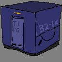

# TTKTK - TTK-91 ToolKit


This Rust package provides both a library, and a standalone binary for assembling TTK-91 source (.k91) into binary (.b91).  
This is part of [TiToMachine](https://github.com/sevonj/titomachine).



## Additions and differences to Titokone
(see: [Titokone](https://www.cs.helsinki.fi/group/titokone/))
- Supports expressing values in bin, oct, and hex.
- Supports expressing values as unsigned.
- Symbols are case sensitive.
- Supports TiToMachine extended spec, but should be fully backwards compatible.

## Usage

```shell
   titoasm --help
```
```shell
   titoasm file.k91
```
```shell
   titoasm file.k91 -o outputfile.b91
```

## Building
You need Rustlang.

Shell examples:
```shell
    cargo build
```
```shell
    cargo test
```
```shell
    cargo run -- file.k91 -o outputfile.b91
```
