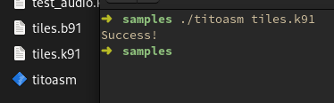

# TTKTK - TTK-91 ToolKit


This Rust package provides both a library, and a standalone executable for managing TTK-91 source (.k91) and binary (.b91) files.
This is part of [TiToMachine](https://github.com/sevonj/titomachine).

Tools:
- **titoasm** - Assemble .k91 to .b91
- (coming soon) **disassembler** - TiToMachine disassembler will be moved here

## Additions and differences to Titokone
(see: [Titokone](https://www.cs.helsinki.fi/group/titokone/))
- Supports expressing values in bin, oct, and hex.
- Supports expressing values as unsigned.
- Symbols are case sensitive.
- Supports TiToMachine extended spec, but should be fully backwards compatible.

## Usage

```shell
   titoasm --help
```
```shell
   titoasm file.k91
```
```shell
   titoasm file.k91 -o outputfile.b91
```

## Use libttktk in rust code
Cargo.toml:
```toml
    [dependencies]

    # ...

    ttktk = { git = "https://github.com/sevonj/ttktk.git", tag = "v0.2.1" } # or whatever is the latest.
```
code:
```rust
    use libttktk::compiler::compile;

    // ...

    let result = compile(source);
```

## Building
You need Rust.

Shell examples:
```shell
    cargo build
```
```shell
    cargo test
```
```shell
    cargo run -- file.k91 -o outputfile.b91
```
